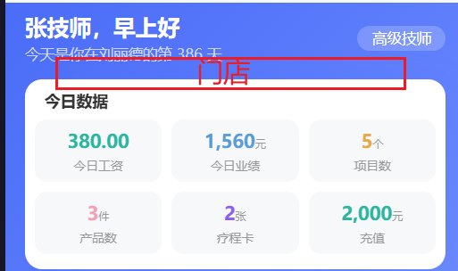
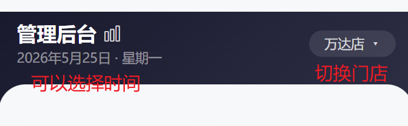
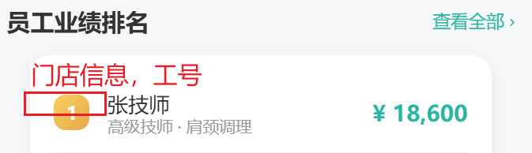
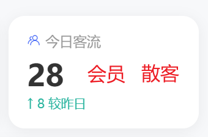

# 会员端

### 门店相关

- 在首页切换门店，登录时候选择门店。
- 消费记录也只看本店

### M1. 消费余额查询（一级）

- 销售记录添加评价功能

### M3. 收银验证码（一级）

- 可选开通密码或者验证码

### M4. 会员预约（二级）

- 不需要选择门店，直接选择登录门店
- 技师暂不开通，保留接口
- 预约记录加上门店电话

# 员工端

- 门店切换：类似会员的门店切换

# 管理端

* 店长：只能看自己店
* 区域经理：只能看旗下门店
* 管理员：能看到所有管理门店

### 员工工资管理

管理端可以看到每一个员工的工资明细

# 收银端

### 销售数据

- 销售汇总加上产品
- 销售明细支持具体业务查询+员工

### 会员沉睡

长时间不消费会员沉睡，管理员解除后才可以使用。

### 移动端配套页面

- 调理记录
- 其余相关配置
